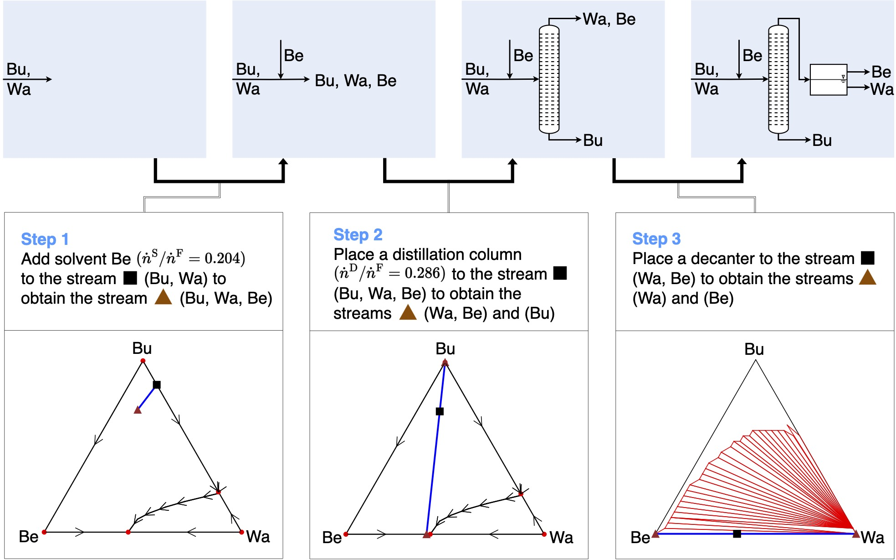

# DRL4ProcSyn



Official PyTorch implementation of the Gumbel AlphaZero-based algorithm for flowsheet synthesis in the paper "[Deep reinforcement learning uncovers processes for separating azeotropic mixtures without prior knowledge](https://arxiv.org/abs/2310.06415)". An agent plays a singleplayer game where it sequentially constructs flowsheets and gets some net present value as episodic reward.

**NOTE: As we are in an AlphaZero-setting, the terms _episode_ and _game_ are used interchangeably in the code.**

Full training/testing with parallel actors is run with

```shell
$ python main.py
```

## Config

Configuration of the runs is separated into two config files: 

1. Everything regarding the general Gumbel AlphaZero setup, number of workers, training devices, optimizer settings, results folders etc., see the config file and comments for individual settings in `./gaz_singleplayer/config_syngame.py`.

	The code is heavily parallelized with ray.io, and the parallelization can be configured with `num_experience_workers` and 
subsequent attributes. See the comments for the individual attributes to adjust the settings for your hardware. (Pre-configured to run 50 parallel MCTS-workers on CPU and training on cuda device 0).

2. Environment configuration including chemical systems considered, simulation settings, discretization etc., see config file and comments for individual settings in `./environment/env_config.py`. 

## Acknowledgments

Thanks to the following repositories:

- [policy-based-self-competition](https://github.com/grimmlab/policy-based-self-competition)
  - General Gumbel AlphaZero implementation.
- [muzero-general](https://github.com/werner-duvaud/muzero-general/)
  - General project setup und file structure
- [mctx](https://github.com/deepmind/mctx)
  - Gumbel MCTS implementation.
- [cem](https://github.com/grimmlab/cem)
  - Convex envelope method for liquid multi-phase equilibria

## Paper

For more details, please see our preprint "[Deep reinforcement learning uncovers processes for separating azeotropic mixtures without prior knowledge](https://arxiv.org/abs/2310.06415)". If this code is useful for your work, please cite our paper:

```
@article{gottl2023deep,
  title={Deep reinforcement learning uncovers processes for separating azeotropic mixtures without prior knowledge},
  author={G{\"o}ttl, Quirin and Pirnay, Jonathan and Burger, Jakob and Grimm, Dominik G},
  journal={arXiv preprint arXiv:2310.06415},
  year={2023}
}
``` 